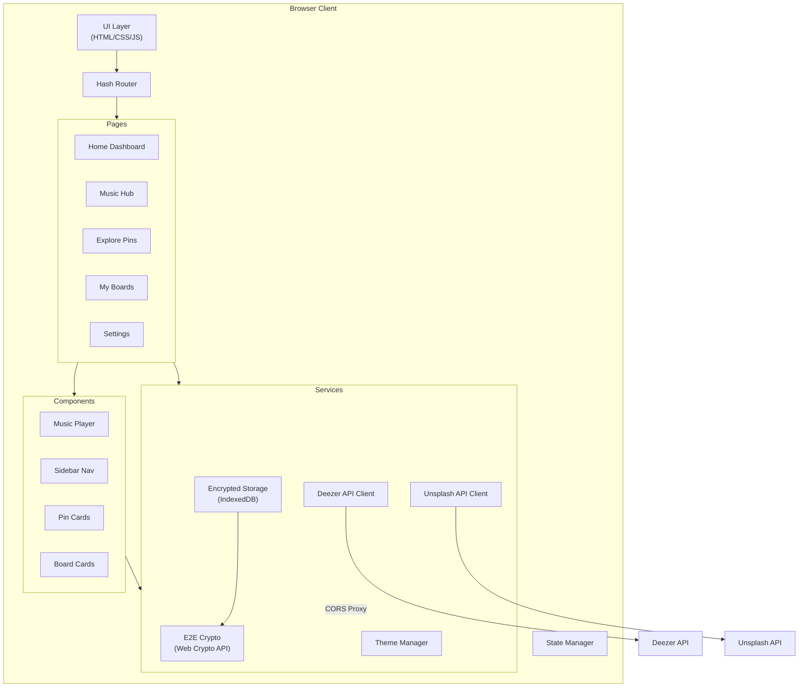

# PinTune — Spotify × Pinterest Fused Application

A premium, end-to-end encrypted application combining music streaming with visual inspiration boards.

## Overview

**PinTune** merges two experiences into one seamless interface:
1. **Music Hub** — Stream music (30s previews via Deezer API, expandable to full tracks), browse albums, search artists, and manage playlists
2. **Inspiration Hub** — Pinterest-style masonry grid for recipes, home décor, style, and project inspiration with Pin/Board organization
3. **E2E Encryption** — All user data (boards, pins, playlists) encrypted client-side using Web Crypto API (AES-GCM + ECDH)
4. **Theme Engine** — Users can switch between 8+ curated themes (Dark Obsidian, Neon Cyber, Sunset Gradient, Ocean Breeze, Forest, Minimal Light, Rose Gold, Midnight Purple)

---

## Tech Stack

| Layer | Technology |
|-------|-----------|
| **Build Tool** | Vite (vanilla JS) |
| **Styling** | Vanilla CSS with CSS custom properties (design tokens) |
| **Music API** | Deezer API (free, no auth needed for search + 30s previews) |
| **Images API** | Unsplash API (free, high-quality images for inspiration) |
| **Encryption** | Web Crypto API (SubtleCrypto — AES-GCM) |
| **Storage** | LocalStorage + IndexedDB (encrypted) |
| **Icons** | Lucide Icons (via CDN) |
| **Fonts** | Google Fonts — Inter + Outfit |

---

## Proposed Changes

### Project Scaffolding

#### [NEW] Vite Project Initialization
- Initialize with `npx -y create-vite@latest ./ -- --template vanilla`
- Clean up default boilerplate

---

### Core Design System

#### [NEW] [index.css](file:///c:/Users/LENOVO/OneDrive/Desktop/SIH%20PROTOTYPE/New%20folder/src/styles/index.css)
- CSS custom properties for all 8 themes (colors, gradients, shadows, blur amounts)
- Global reset and typography (Inter for body, Outfit for headings)
- Glassmorphism utility classes (backdrop-blur, semi-transparent backgrounds)
- Responsive breakpoints system
- Smooth transition system for theme switching
- Scrollbar styling
- Animation keyframes (fade-in, slide-up, pulse, shimmer skeleton loaders)

#### [NEW] [themes.css](file:///c:/Users/LENOVO/OneDrive/Desktop/SIH%20PROTOTYPE/New%20folder/src/styles/themes.css)
All 8 theme definitions using `[data-theme="name"]` selectors:
1. **Dark Obsidian** (default) — Deep blacks + emerald accents
2. **Neon Cyber** — Dark with electric blue/pink neon glows
3. **Sunset Gradient** — Warm oranges, pinks, purples
4. **Ocean Breeze** — Deep blues + aqua highlights
5. **Forest** — Dark greens + gold accents
6. **Minimal Light** — Clean white + subtle gray with violet accent
7. **Rose Gold** — Elegant pink-gold palette
8. **Midnight Purple** — Deep purple gradients + silver

---

### Application Shell & Navigation

#### [NEW] [index.html](file:///c:/Users/LENOVO/OneDrive/Desktop/SIH%20PROTOTYPE/New%20folder/index.html)
- SEO-optimized meta tags
- Google Fonts + Lucide Icons CDN links
- App shell with sidebar, main content area, and bottom music player
- Proper semantic HTML5 structure

#### [NEW] [app.js](file:///c:/Users/LENOVO/OneDrive/Desktop/SIH%20PROTOTYPE/New%20folder/src/app.js)
- Router (hash-based SPA routing)
- Theme manager initialization
- Encryption module initialization
- Global state management
- Page lifecycle management

#### [NEW] [sidebar.js](file:///c:/Users/LENOVO/OneDrive/Desktop/SIH%20PROTOTYPE/New%20folder/src/components/sidebar.js)
- Navigation links: Home, Music, Explore (Pins), My Boards, My Playlists, Settings
- Active state indicators with animated pill
- Collapsible on mobile (hamburger menu)
- User avatar/profile section at top
- "Now Playing" mini-widget

---

### Music Hub (Spotify-like)

#### [NEW] [musicPlayer.js](file:///c:/Users/LENOVO/OneDrive/Desktop/SIH%20PROTOTYPE/New%20folder/src/components/musicPlayer.js)
- Fixed bottom bar with glassmorphic design
- Album art (animated vinyl rotation when playing)
- Song title + artist with marquee overflow
- Play/Pause, Next, Previous, Shuffle, Repeat controls
- Progress bar (seekable `<input type="range">` with custom styling)
- Volume control with mute toggle
- Queue indicator
- Audio visualization (canvas-based frequency bars)
- Uses HTML5 `<audio>` element for Deezer 30s previews

#### [NEW] [musicHome.js](file:///c:/Users/LENOVO/OneDrive/Desktop/SIH%20PROTOTYPE/New%20folder/src/pages/musicHome.js)
- Hero banner with featured playlist/album (gradient overlay)
- "Recently Played" horizontal scroll cards
- "Top Charts" grid
- "Browse by Genre" category chips (Pop, Rock, Hip-Hop, Classical, Jazz, Electronic, Bollywood, etc.)
- "New Releases" carousel
- Each card: album art, title, artist, play button overlay on hover

#### [NEW] [musicSearch.js](file:///c:/Users/LENOVO/OneDrive/Desktop/SIH%20PROTOTYPE/New%20folder/src/pages/musicSearch.js)
- Search bar with debounced Deezer API calls
- Results displayed as track list + album grid
- Instant play on click
- "Add to Playlist" functionality

#### [NEW] [deezerApi.js](file:///c:/Users/LENOVO/OneDrive/Desktop/SIH%20PROTOTYPE/New%20folder/src/services/deezerApi.js)
- Search tracks, albums, artists via Deezer API (CORS proxy for client-side)
- Fetch top charts
- Fetch genre lists
- Get album details with track listing
- Rate limiting handler

#### [NEW] [playlist.js](file:///c:/Users/LENOVO/OneDrive/Desktop/SIH%20PROTOTYPE/New%20folder/src/components/playlist.js)
- Create/edit/delete playlists (stored encrypted in IndexedDB)
- Drag-and-drop reorder
- Playlist cover mosaic (auto-generated from first 4 track arts)
- Play all / Shuffle play

---

### Inspiration Hub (Pinterest-like)

#### [NEW] [exploreHome.js](file:///c:/Users/LENOVO/OneDrive/Desktop/SIH%20PROTOTYPE/New%20folder/src/pages/exploreHome.js)
- Category tabs: All, Recipes, Home & Décor, Style & Fashion, DIY Projects, Travel, Art
- Masonry grid layout (CSS columns with `break-inside: avoid`)
- Infinite scroll with skeleton loading
- Each pin card: image, title, save-to-board button, like count
- Hover: zoom effect + quick-save overlay
- Data sourced from Unsplash API with curated category searches

#### [NEW] [pinDetail.js](file:///c:/Users/LENOVO/OneDrive/Desktop/SIH%20PROTOTYPE/New%20folder/src/pages/pinDetail.js)
- Full-size image view with blur background
- Pin title, description, source link
- "Save to Board" dropdown
- Related pins grid below
- Comments section (encrypted, stored locally)

#### [NEW] [boardsPage.js](file:///c:/Users/LENOVO/OneDrive/Desktop/SIH%20PROTOTYPE/New%20folder/src/pages/boardsPage.js)
- User's board collection displayed as styled cards
- Create new board (name, description, cover image)
- Board detail view with all saved pins in masonry layout
- Edit/delete boards
- Board cover = mosaic of first 3 pins

#### [NEW] [unsplashApi.js](file:///c:/Users/LENOVO/OneDrive/Desktop/SIH%20PROTOTYPE/New%20folder/src/services/unsplashApi.js)
- Search photos by category/query
- Fetch curated collections for each category
- Pagination support
- Image optimization (use appropriate sizes)

---

### End-to-End Encryption

#### [NEW] [crypto.js](file:///c:/Users/LENOVO/OneDrive/Desktop/SIH%20PROTOTYPE/New%20folder/src/services/crypto.js)
- **Key Generation**: AES-GCM 256-bit key via `crypto.subtle.generateKey()`
- **Key Derivation**: PBKDF2 from user's passphrase (100,000 iterations, SHA-256)
- **Encrypt**: `crypto.subtle.encrypt()` with random IV per operation
- **Decrypt**: `crypto.subtle.decrypt()` with stored IV
- **Key Storage**: Encrypted master key stored in IndexedDB
- **Data at rest**: All boards, pins, playlists, preferences encrypted before storage
- Visual encryption indicator (lock icon) in the UI

#### [NEW] [storage.js](file:///c:/Users/LENOVO/OneDrive/Desktop/SIH%20PROTOTYPE/New%20folder/src/services/storage.js)
- IndexedDB wrapper with encrypt-before-write / decrypt-after-read
- Object stores: `boards`, `pins`, `playlists`, `preferences`, `keys`
- CRUD operations for all data types
- Export/import encrypted data backups

---

### Theme Engine

#### [NEW] [themeManager.js](file:///c:/Users/LENOVO/OneDrive/Desktop/SIH%20PROTOTYPE/New%20folder/src/services/themeManager.js)
- Apply theme by setting `data-theme` attribute on `<html>`
- Persist theme preference (encrypted in storage)
- Smooth CSS transitions when switching themes
- Expose theme preview swatches

#### [NEW] [settingsPage.js](file:///c:/Users/LENOVO/OneDrive/Desktop/SIH%20PROTOTYPE/New%20folder/src/pages/settingsPage.js)
- Theme picker with live preview grid (8 theme cards showing color swatches)
- Encryption status & key management
- Data export/import
- Clear all data option
- About section with encryption explanation

---

### Home / Dashboard

#### [NEW] [homePage.js](file:///c:/Users/LENOVO/OneDrive/Desktop/SIH%20PROTOTYPE/New%20folder/src/pages/homePage.js)
- Welcome hero with time-based greeting
- "Continue Listening" — recent tracks horizontal carousel
- "Your Boards" — board previews
- "Trending Inspiration" — curated pins
- "Recommended for You" — mixed music + pins based on recent activity
- Quick action buttons (New Board, New Playlist, Search)

---

## User Review Required

> [!IMPORTANT]
> **Music Streaming Limitation**: The Deezer API provides **30-second previews** for free. Full-length streaming would require a paid music licensing agreement. The app will clearly indicate this to users and provide links to full tracks on Deezer. Is this acceptable?

> [!IMPORTANT]
> **Local-Only Storage**: Since this is a client-side application, all data (boards, pins, playlists) is stored in the browser's IndexedDB with E2E encryption. There is no server/backend — data lives only on the user's device. This means data won't sync across devices. Should I add an export/import feature for portability?

> [!IMPORTANT]
> **Unsplash API**: For the Pinterest-style inspiration images, I'll use the Unsplash API (free tier: 50 requests/hour). This provides real, high-quality images for recipes, home, style, and projects. Acceptable?

## Open Questions

> [!NOTE]
> **Authentication Flow**: Should there be a sign-up/login screen where users set their encryption passphrase? Or should the app auto-generate keys on first use with an optional passphrase lock?

## Architecture



## File Structure

```
project-root/
├── index.html
├── package.json
├── vite.config.js
├── public/
│   └── favicon.svg
├── src/
│   ├── main.js                    # Entry point
│   ├── app.js                     # App shell, router, state
│   ├── styles/
│   │   ├── index.css              # Global styles, reset, typography
│   │   ├── themes.css             # 8 theme definitions
│   │   ├── components.css         # Component-specific styles
│   │   ├── music.css              # Music player & hub styles
│   │   ├── pins.css               # Pinterest-style layout styles
│   │   └── animations.css         # Keyframes & transitions
│   ├── components/
│   │   ├── sidebar.js
│   │   ├── musicPlayer.js
│   │   ├── pinCard.js
│   │   ├── boardCard.js
│   │   ├── modal.js
│   │   └── toast.js
│   ├── pages/
│   │   ├── homePage.js
│   │   ├── musicHome.js
│   │   ├── musicSearch.js
│   │   ├── exploreHome.js
│   │   ├── pinDetail.js
│   │   ├── boardsPage.js
│   │   └── settingsPage.js
│   └── services/
│       ├── crypto.js
│       ├── storage.js
│       ├── deezerApi.js
│       ├── unsplashApi.js
│       ├── themeManager.js
│       └── state.js
```

## Verification Plan

### Automated Tests
1. **Dev Server**: Run `npm run dev` and verify the application loads without errors
2. **Browser Test**: Navigate through all pages (Home, Music, Explore, Boards, Settings)
3. **Music Playback**: Search for a song, play it, verify audio plays and controls work
4. **Pin/Board Flow**: Browse inspiration, save a pin to a board, verify it persists
5. **Theme Switching**: Switch between all 8 themes, verify smooth transitions
6. **Encryption**: Verify data in IndexedDB is encrypted (inspect via DevTools)
7. **Responsive**: Test at mobile (375px), tablet (768px), and desktop (1440px) widths

### Manual Verification
- Visual inspection of all pages for premium aesthetic quality
- Cross-browser testing (Chrome, Firefox, Edge)
- Performance check (no jank during theme switches or page transitions)
